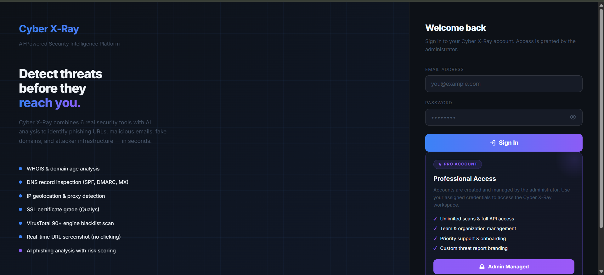
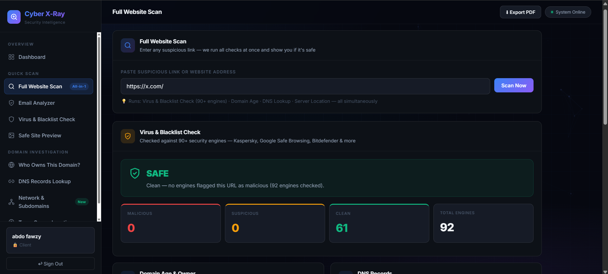
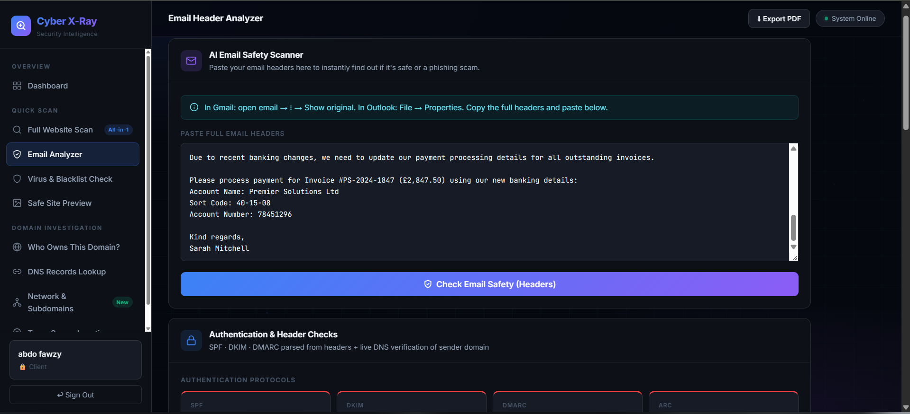
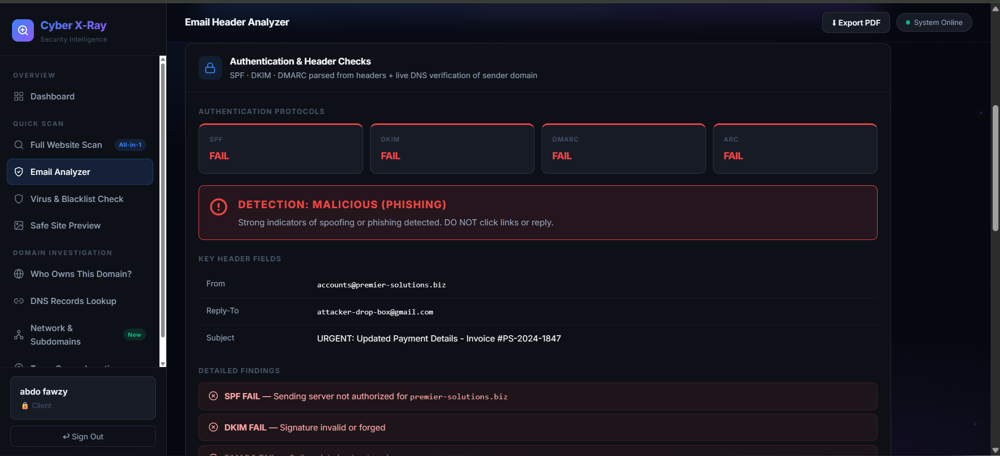
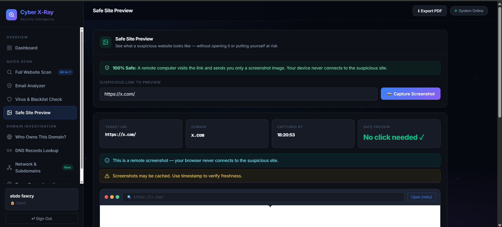
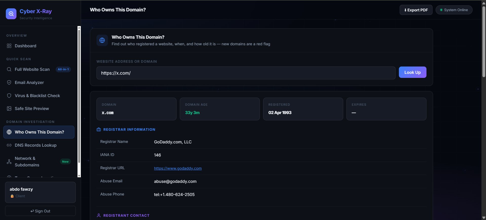
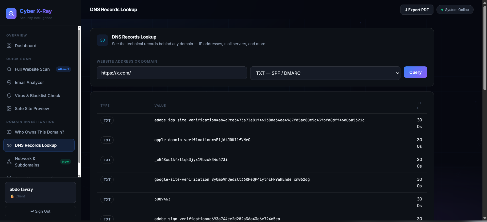
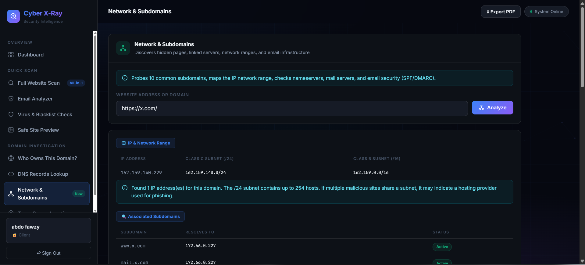
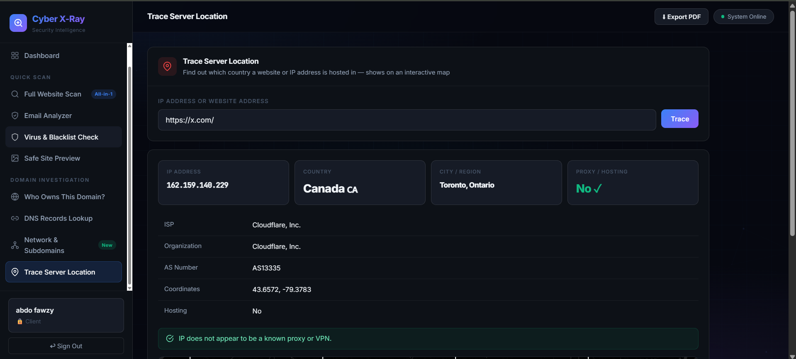
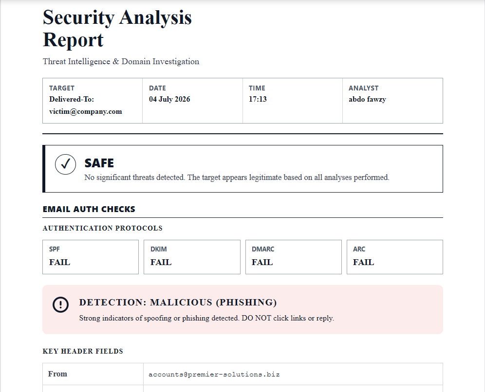

# Cyber X-Ray - AI-Powered Security Intelligence Platform

  

  <b>An integrated security intelligence platform designed for comprehensive threat detection and domain investigation.</b>

  <a href="#features">Features</a> •
  <a href="#architecture">Architecture</a> •
  <a href="#screenshots">Screenshots</a> •
  <a href="#security-protocols">Protocols</a> •
  <a href="#team">Team</a>

---

## Overview

**Cyber X-Ray** is an AI-powered security intelligence platform that combines **eight specialized security tools** into a unified dashboard. It enables security analysts to perform rapid assessments of websites, email headers, DNS records, domain ownership, and server geolocation from a single interface.

Developed as part of the **Digital Egypt Pioneers Initiative (Cybersecurity Track 2026)**, the platform integrates with **90+ security engines** including Kaspersky, Google Safe Browsing, and Bitdefender for real-time threat intelligence.

---

## Features

### 1. Full Website Scan (All-in-1)
Comprehensive security assessment that runs multiple checks simultaneously:
- Virus & Blacklist verification across **90+ security engines**
- Domain age analysis and registration history
- DNS records analysis
- Server location and IP geolocation

  

### 2. Email Header Analyzer
Detect phishing attempts and email spoofing by analyzing authentication protocols:
- **SPF** (Sender Policy Framework) validation
- **DKIM** (DomainKeys Identified Mail) signature verification
- **DMARC** policy enforcement check
- **ARC** (Authenticated Received Chain) validation
- Live DNS verification of sender domain

| Email Input | Phishing Detection Results |
|:---:|:---:|
|  |  |

### 3. Virus & Blacklist Check
Query over 90 security engines to determine if a URL has been flagged:
- Antivirus vendors (Kaspersky, Bitdefender, McAfee, ESET)
- Safe Browsing (Google, Microsoft)
- Threat Intelligence (ThreatBook, URLhaus, PhishTank)
- Domain Reputation (Spamhaus, SURBL, Abuse.ch)

### 4. Safe Site Preview
Visually inspect suspicious websites without risk:
- Remote screenshot capture via isolated environment
- Analyst's device never connects to the target
- Timestamp verification for freshness

  

### 5. WHOIS Domain Lookup
Retrieve domain registration information:
- Domain metadata (age, registration/expiry dates)
- Registrar details (name, IANA ID, abuse contacts)
- Registrant, administrative, and technical contacts

  

### 6. DNS Records Lookup
Query technical DNS records behind any domain:
- **A / AAAA** - IPv4 and IPv6 address records
- **MX** - Mail exchange records
- **TXT (SPF/DMARC)** - Email authentication policies
- **NS** - Name server records
- **CNAME** - Canonical name aliases
- **SOA** - Administrative zone information

  

### 7. Network & Subdomains
Discover hidden infrastructure:
- IP and network range mapping (Class C /24 and Class B /16)
- Subdomain enumeration (10 common subdomains)
- Nameserver analysis
- Mail server detection
- Email security configuration checks

  

### 8. Trace Server Location
Determine server geolocation and detect anonymization:
- IP geolocation with MaxMind GeoIP2
- Country, city, and region data
- ISP and organization identification
- ASN (Autonomous System Number)
- Proxy/VPN detection

  

---

## Architecture

Cyber X-Ray follows a modern **client-server architecture** with modular design:

| Component | Technology | Description |
|-----------|-----------|-------------|
| **Frontend** | React (SPA) | Modular tool components with unified dashboard |
| **Backend API** | Python RESTful API | Tool orchestration and data aggregation |
| **Security Engines** | 90+ integrations | Kaspersky, Google Safe Browsing, Bitdefender, etc. |
| **DNS Resolvers** | Multi-provider | DNS query system for all record types |
| **WHOIS Service** | Real-time API | Domain registration lookups |
| **IP Geolocation** | MaxMind GeoIP2 | Physical location mapping |
| **PDF Generator** | Automated engine | Professional report generation |

---

## Security Protocols

### Email Authentication Protocols

| Protocol | Mechanism | Failure Indicates | Severity |
|----------|-----------|-------------------|----------|
| **SPF** | IP Authorization | Unauthorized sending server | High |
| **DKIM** | Cryptographic Signature | Tampering or forgery | High |
| **DMARC** | Policy Enforcement | Complete authentication failure | Critical |
| **ARC** | Chain Validation | Broken forwarding chain | Medium |

### DNS Security Protocols
- **TXT Records** - SPF/DMARC policies and domain verification
- **MX Records** - Mail infrastructure analysis
- **NS Records** - DNS hijacking detection

### IP & Network Protocols
- **IP Geolocation** - Physical location verification
- **ASN** - Autonomous system identification
- **Proxy/VPN Detection** - Anonymous access identification

---

## Security Status Analysis

### SAFE State
- 0 malicious / 0 suspicious engine detections
- Email authentication protocols all PASS
- Established domain age (>1 year)
- No proxy/VPN detected
- Reputable registrar and hosting

### MALICIOUS State
- One or more security engines flagged the target
- SPF/DKIM/DMARC/ARC authentication failures
- Domain mismatch (From vs Reply-To)
- Recently registered domain (<30 days)
- Proxy/VPN anonymization detected

---

## PDF Report Export

Generate professional security analysis reports suitable for enterprise documentation and compliance auditing:

  

---

## Screenshots

All feature screenshots are available in the [`assets/`](assets/) folder:

| Screenshot | Description |
|------------|-------------|
| [`login-page.png`](assets/login-page.png) | Secure login interface with admin-managed access |
| [`full-website-scan.png`](assets/full-website-scan.png) | All-in-1 website security scan results |
| [`email-analyzer-input.png`](assets/email-analyzer-input.png) | Email header input interface |
| [`email-analyzer-results.png`](assets/email-analyzer-results.png) | Phishing detection with authentication failures |
| [`safe-site-preview.png`](assets/safe-site-preview.png) | Remote screenshot capture feature |
| [`whois-lookup.png`](assets/whois-lookup.png) | Domain registration and age information |
| [`dns-records-lookup.png`](assets/dns-records-lookup.png) | DNS TXT/SPF/DMARC records |
| [`network-subdomains.png`](assets/network-subdomains.png) | Infrastructure and subdomain mapping |
| [`trace-server-location.png`](assets/trace-server-location.png) | IP geolocation and proxy detection |
| [`pdf-report.png`](assets/pdf-report.png) | Professional PDF security analysis report |

---

## Key Achievements

| Metric | Value |
|--------|-------|
| Security Tools Integrated | 8 |
| Security Engines Queried | 90+ |
| Email Authentication Protocols | 4 (SPF, DKIM, DMARC, ARC) |
| DNS Record Types Supported | 6+ (A, AAAA, MX, TXT, NS, CNAME, SOA) |
| Report Export Format | PDF |

---

## Future Enhancements

- **Machine Learning Integration** - AI models for automated threat scoring
- **Real-time Monitoring** - Continuous monitoring with alerting
- **API Expansion** - Public REST API for SIEM/SOAR integration
- **SSL/TLS Analysis** - Certificate inspection and weak cipher detection
- **Threat Intelligence Feeds** - Additional IOC detection sources
- **Multi-tenant Support** - Organization-level access control

---

## Team

  <b>Digital Egypt Pioneers Initiative - Cybersecurity Track - 2026</b>

| Name | Role |
|------|------|
| **Mina Samy** | Project Lead |
| **George Salah** | Development |
| **Youssef Hussein** | Development |
| **Ahmed Hassan** | Development |
| **Abdelrahman Mahmoud** | Development |
| **Ali Essam** | Development |

---

  <i>Developed for the Digital Egypt Pioneers Initiative | Cybersecurity Track | 2026</i>

